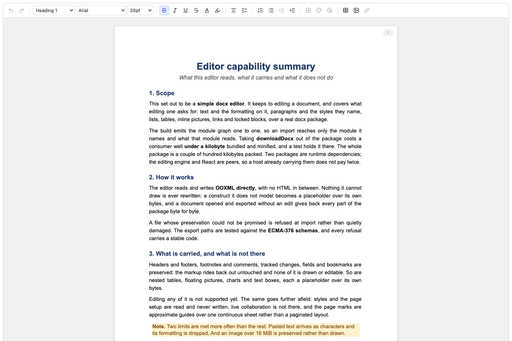

# @portone/docx-editor

A simple DOCX editor for the browser that reads and writes OOXML directly while preserving the document structure around each edit. Edit text, formatting, lists, tables, images, links, and locked content controls without an HTML conversion step.

<p align="center">
  
</p>

## Quick start

```sh
npm install @portone/docx-editor
```

```tsx
import "@portone/docx-editor/styles.css";

import { DocxEditor, type DocxEditorHandle } from "@portone/docx-editor";
import { useRef } from "react";

export function Editor({ file }: { file: File }) {
  const editorRef = useRef<DocxEditorHandle | null>(null);

  return <DocxEditor ref={editorRef} document={file} />;
}
```

`document` accepts a `File`, `Blob`, `ArrayBuffer`, or `Uint8Array`; use the ref to export the edited document as bytes.

## What it does

- Provides browser editing with built-in controls, read-only mode, and document locking.
- Fits the page to the available width by default and lets readers choose a fixed zoom level.
- Exports edited documents as DOCX bytes or browser downloads.
- Preserves document structures and package parts across edits.
- Reads document styles, theme fonts, page layout, and CJK font information for display.

See [Feature support](./docs/features.md) for the support matrix. Build [custom controls](./docs/custom-controls.md) or use [programmatic DOCX import and export](./docs/core.md).

## Contributing

Contributions are welcome; see [CONTRIBUTING.md](./CONTRIBUTING.md) to get started.

## License

Licensed under the [Apache License 2.0](./LICENSE).
